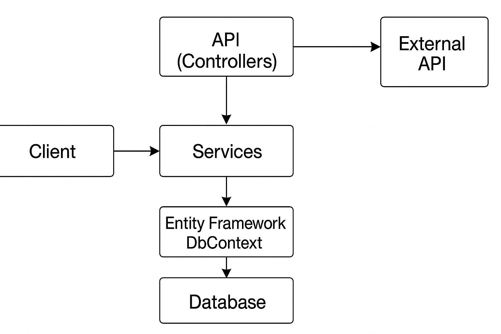

# API de Produtos — Trabalho de C#



## Estrutura do projeto

```
StudentApi/
├── Controllers/
│   ├── ExternalController.cs
│   └── ProductsController.cs
├── Data/
│   └── ApplicationDbContext.cs
├── Models/
│   ├── Joke.cs
│   └── Product.cs
├── Services/
│   ├── JokeService.cs
│   └── ProductService.cs
├── Program.cs
└── StudentApi.csproj
```

- **Models** – Contêm as classes `Product` e `Joke`. `Product` define as
  propriedades do produto com validações por `DataAnnotations`.
  `Joke` representa o modelo retornado pela API externa.
- **Data** – A classe `ApplicationDbContext` herda de `DbContext` e define o
  `DbSet<Product>`.
- **Services** – `ProductService` encapsula a lógica de negócios e o
  acesso ao banco. `JokeService` executa requisições HTTP usando
  `HttpClient` para a API de piadas.
- **Controllers** – `ProductsController` expõe o CRUD e pesquisa por
  produtos. `ExternalController` expõe o endpoint de piada.
- **Program.cs** – Configura serviços, banco em memória, Swagger,
  injeta serviços e inicializa dados de exemplo.

## Como executar localmente

1. Instale o **SDK .NET 8** ou superior.
2. Clone este repositório e navegue até a pasta `StudentApi`.
3. Restaure os pacotes e execute o projeto:

   ```bash
   dotnet restore
   dotnet run
   ```

4. A aplicação será iniciada em `https://localhost:5001` (ou porta similar).
   A documentação interativa estará disponível em
   `https://localhost:5001/swagger`.

Os primeiros produtos são carregados em memória automaticamente. Use a
interface Swagger para testar os endpoints de CRUD e pesquisa.


